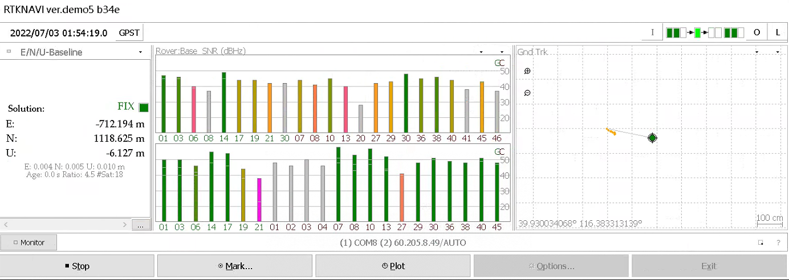
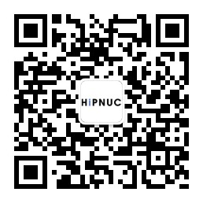

## 资料总览

本公司持续维护、更新产品与软件，为用户提供更良好的使用体验与功能。产品的用户手册请在官方网站资料下载页面中下载

| 文件夹   | 说明          | 详细                                                         |
| -------- | ------------- | ------------------------------------------------------------ |
| hardware | 硬件资料      | 评估板原理图尺寸。外壳参数，尺寸等                           |
| examples | 驱动例程      | 包含STM32和ROS解析NMEA数据的例程                             |
| rtknavi  | rtknavi上位机 | 包含HI600原始观测数据及rtknavi上位机，用户评估HI600性能和在PC端接入千寻查看实现RTK定位。 |

## HI600 RTCM 原始观测输出样本

本节描述如何使用rtknavi.exe 播放HI600和千寻基站的原始观测数据并进行差分解算。  所涉及的文件均在rtknavi文件夹下。

时间: 20220703

流动站: HI600模块，以1Hz输出RTCM数据流 约5min数据(配置串口0只输出RTCM) RTCM数据包含GPS/BD/伽利略的星历和观测数据， 可使用RTKLIB转为REINX处理

基站: 千寻

* hi6001.dat: 流动站HI600 rtcm数据
* hi600.dat.tag 流动站HI600 rtcm数据时间戳文件(由rtknavi生成)
* qx.dat: 基站HI600 rtcm数据
* qx.dat.tag 基站HI600 rtcm数据时间戳文件(由rtknavi生成)

rtknavi版本为demo5 b34f.   可直接运行rtknavi.exe查看效果。

## 使用千寻账号来接入差分信息实现RTK定位

1. 确保上节描述的rtknavi软件可以正确使用。
2. 不熟悉的rtknavi软件的客户可先入门rtknavi软件:https://space.bilibili.com/479790048
3. 注册，购买千寻或其他家的CORS账号，获得账号及密码。
4. 参考HI600手册中的 **搭建最小RTK系统** 章节，接入HI600的RTCM和千寻的RTCM差分数据，rtknavi会自动解算并给出RTK结果。

更多内容请访问

> * 网站：www.hipnuc.com

欢迎关注超核电子:

